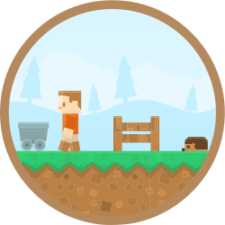

<h1 align="center">
  
   
  Blockycraft
</h1>

  Blockycraft is an interactive demo that uses standard first person controls to navigate through a block world

 

## Summary

Blockycraft is an interactive demo that uses standard first person controls to navigate through a block world. Blockycraft is a interactive graphics demo to create a Minecraft inspired demo which revolves around breaking and placing blocks. The game world is composed of rough cubes arranged in a fixed grid pattern and representing different materials, such as dirt, stone, and snow.  The techniques used in the demo can be toggled using keyboard commands.  The Blockycraft project is written using C++ and OpenGL.

### Status

Development of the project has halted.

## Development

Original blockycraft project was a hack & slash project. It was then refactored, combining knowledge from Fodgleman/Craft to make improvements to the original source of Blockycraft. The project as is, is the result of.

The project is now archived, but provided here as is.

## Acknowledgements

The project icon is retrieved from [kenney.nl](docs/icon/icon.json). The original source material has been altered for the purposes of the project. The icon is used under the terms of the [CC0 1.0 Universal](https://creativecommons.org/publicdomain/zero/1.0/).

The project uses assets by [Kenney from kenney.nl/](http://kenney.nl/assets/voxel-pack), and the icon is built from these assets.
